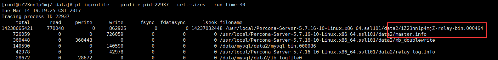

# CPU iowait分析


## cpu iowait的理解

iowait 不同的系统显示不同，有%iowait、%wio、%wa

```
%iowait
       Show the percentage of time that the CPU or CPUs were idle during which the system had an outstanding disk I/O request.
       
Total CPU Idle time since boot  = idle + iowait       
```

**%iowait 表示在一个采样周期内有百分之几的时间属于以下情况：CPU空闲、并且有仍未完成的I/O请求。**

**iowait期间，CPU是空闲的，可以被调用的；iowait高，不一定是I/O有瓶颈**

**对 %iowait 常见的误解有两个：一是误以为 %iowait 表示CPU不能工作的时间，二是误以为 %iowait 表示I/O有瓶颈。**

第一种误解太低级了，%iowait 的首要条件就是CPU空闲，既然空闲当然就可以接受运行任务，只是因为没有可运行的进程，CPU才进入空闲状态的。那为什么没有可运行的进程呢？因为进程都处于休眠状态、在等待某个特定事件：比如等待定时器、或者来自网络的数据、或者键盘输入、或者等待I/O操作完成，等等。

第二种误解更常见，为什么人们会认为 %iowait 偏高是有I/O瓶颈的迹象呢？他们的理由是：”%iowait  的第一个条件是CPU空闲，意即所有的进程都在休眠，第二个条件是仍有未完成的I/O请求，意味着进程休眠的原因是等待I/O，而 %iowait 升高则表明因等待I/O而休眠的进程数量更多了、或者进程因等待I/O而休眠的时间更长了。“ 听上去似乎很有道理，但是不对：

首先 %iowait 升高并不能证明等待I/O的进程数量增多了，也不能证明等待I/O的总时间增加了。为什么呢？看看下面两张图就明白了。

第一张图演示的是，在I/O完全一样的情况下，CPU忙闲状态的变化就能够影响 %iowait 的大小。下图我们看到，在CPU繁忙期间发生的I/O，无论有多少，%iowait 的值都是不受影响的（因为 %iowait 的第一个前提条件就是CPU必须空闲）；当CPU繁忙程度下降时，有一部分I/O落入了CPU空闲的时间段内，这就导致了 %iowait 升高。可见，I/O并没有变化，%iowait 却升高了，原因仅仅是CPU的空闲时间增加了。请记住，系统中有成百上千的进程数，任何一个进程都可以引起CPU和I/O的变化，因为 %iowait、%idle、%user、%system 等这些指标都是全局性的，并不是特指某个进程。


再往下看第二张图，它描述了另一种情形：假设CPU的繁忙状况保持不变的条件下，即使 %iowait 升高也不能说明I/O负载加重了。
如果2个I/O请求依次提交、使得整个时段内始终有I/O在进行，那么 %iowait 是100%；
如果3个I/O请求同时提交，因为系统有能力同时处理多个I/O，所以3个并发的I/O从开始到结束的时间与一个I/O一样，%iowait 的结果只有50%。
2个I/O使 %iowait 达到了100%，3个I/O的 %iowait 却只有50%，显然 %iowait 的高低与I/O的多少没有必然关系，而是与I/O的并发度相关。所以，仅凭 %iowait 的上升不能得出*I/O负载增加* 的结论。


 

这就是为什么说 %iowait 所含的信息量非常少的原因，它是一个非常模糊的指标，如果看到 %iowait 升高，还需检查I/O量有没有明显增加，avserv/avwait/avque等指标有没有明显增大，应用有没有感觉变慢，如果都没有，就没什么好担心的。


## MySQL iowait高分析实列

 我们有一服务器，上面运行着两个mysql实例，这几天iowait一直很高，在20-30%，下午特地专门排查和解决了下，相关过程整理如下。

该服务器有两个挂载盘，服务器在阿里云上，一个系统盘，一个数据盘。

因为非生产库，测试kill -9 mysql-pid后，top如下：


虽然mysql占用内存释放了，但是swap还是占着，虽然swap没有释放，但其不一定会用到，如下：


可见，swap没有活动，但是io很高（block out），bo是写磁盘。

如果不放心swap占用的话，可以通过下列命令释放swap

\# sync

\# echo 3 > /proc/sys/vm/drop_caches

\# swapoff -a

执行后，会将swap中缓存的数据刷新到磁盘，并逐渐释放，如下：


\# swapon -a  # 启用swap

但是io还是很高，此时，可通过iotop确定是那些文件、哪些进程的io读写频繁，可知是mysqld和jbd2（ext4写日志的进程）为主，并且主要在vda盘。


 但是，仅仅iotop看不出每个磁盘设备的完整情况，此时可通过sar -d看每块盘的情况，如下：

 

由上图可知，主要是vda设备的写入特别繁忙。

DEV      磁盘设备
用参数-p可以打印出sda,hdc等磁盘设备名称,如果不用参数-p,设备节点则有可能是dev8-0,dev22-0
tps:每秒从物理磁盘I/O的次数.多个逻辑请求会被合并为一个I/O磁盘请求,一次传输的大小是不确定的.
rd_sec/s:每秒读扇区的次数.
wr_sec/s:每秒写扇区的次数.
avgrq-sz:平均每次设备I/O操作的数据大小(扇区).
avgqu-sz:磁盘请求队列的平均长度.
await:从请求磁盘操作到系统完成处理,每次请求的平均消耗时间,包括请求队列等待时间,单位是毫秒(1秒=1000毫秒).
svctm:系统处理每次请求的平均时间,不包括在请求队列中消耗的时间.
%util:I/O请求占CPU的百分比,比率越大,说明越饱

接下去，我们就可以通过pt-ioprofile查看io读写最多的文件（虽然pt-ioprofile是percona发布的，但是它同样可以查看其他程序比如java进程的io读写）。


 

需要注意的是，pt-ioprofile输出中每列含义的实际意义要根据上下文来说，没有直接的过高或者过低。在本例上，我们上述已经知道磁盘写是瓶颈，所以read/lseek需要忽略。

pwrite/write是消耗iowait的主要部分。

在我们的问题中，data/data2是两个实例的data_dir，都在vda挂载的FS中，所以我们需要将其移动到vdb才能缓解。

因为移动整个实例不太现实，所以，我们打算移动部分文件到vdb。注：iowait的比例范围跟磁盘数有关，越多，iowait可能的值越大。


现在，来说下打算移动哪些文件。

oracle和mysql最大的差别在于：

oracle不存在引擎插件一说，所以，没有mysql的innodb_log和mysql_bin之分，同时mysql还有一个doublewrite文件，应该来说，任何时候这三个是最占据io的文件，data文件一般不会成为瓶颈。

从上可知，doublewrite是消耗大户，应该放到单独磁盘比较合适，只不过5.6版本之后，percona server去掉了innodb_doublewrite_file这个参数（percona 5.7新增了一个相关参数innodb_parallel_doublewrite_path，尚未仔细测试https://www.percona.com/doc/percona-server/5.7/performance/xtradb_performance_improvements_for_io-bound_highly-concurrent_workloads.html），mysql本身不支持自定义doublewrite的位置。所以，打算挪binlog和ib_log，故更改初始化参数innodb_log_group_home_dir=/VDB_DATA、log_bin=/VDB_DATA/mysql-bin、log_bin_index=/VDB_DATA/mysql-bin.index，重启mysql实例后，如下：


虽然vda依然繁忙，但是vdb已经分担了部分的io活动。

再进一步，我们可以通过ps -eLf找到23078线程所属进程，如下：


用ioprofile确定是哪个文件：



此时，主要是slave相关文件。

注意：在很多的优化文章或者PPT中，会见到建议将`slave_master_info存储为innodb表，事实上在io是瓶颈的系统中，由于mysql实现体系的原因，将其存储在innodb中会加剧xb_doublewrite的活动，不一定能够达到更好的效果，甚至更差（https://dev.mysql.com/doc/refman/5.7/en/slave-logs.html）。`

更改relay-log-index=/VDB_DATA/relay-bin.index，relay-log=/VDB_DATA/relay-bin，重启mysql实例后，如下：


调整后，io分布式是比较均匀了，但是可以发现vdb的iops明显低于vda，所以可能还需要进一步调整以达到较为满意的效果。


