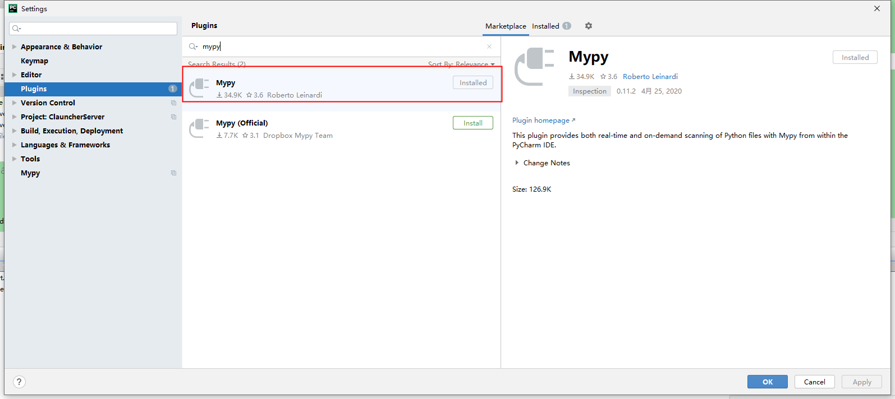

# python类型检查

## 一、Quick Start

```python
def headline(text: str, align: bool = True) -> str:
    if align:
        return f"{text.title()}\n{'-' * len(text)}"
    else:
        return f" {text.title()} ".center(50, "o")


print(headline("python type checking"))
print(headline("use mypy", align="left"))

```


- 需要注意的是，这些代码在执行时是不会报错的，因为 Python 仍然是动态类型语言，运行期不会进行类型检查，只有用 mypy 等工具去检查时才会有效。

### pycharm mypy配置

- 安装mypy

```python
pip install mypy
```

- 配置pycharm

  - 安装mypy plugin： file => settings => plugins 

    

  - 配置

    


## 二、引入类型检查的优缺点

- 优点

  1. 在运行之前发现bug
  2. 提高代码的可读性
  3. 优化编码提醒
  4. 协助代码重构

- 缺点

  - 会增加代码的维护成本

  - 会降低灵活性，比如某个参数类型设置为`str`，那么该参数传了其他类型 检查的时候会报错

    

## 三、语法详解

### 版本发展

- Python 3.0 开始引入了函数参数和返回值的类型注解，但当时并不是专门为静态类型检查设计的。
- Python 3.5 我们才能正式使用静态类型检查，`typing` 模块也是从这个版本开始引入的。
- Python 3.6 则是增加了本地变量的类型注解语法，让类型检查功能更加完整。
- Python 3.7 开始类型注解会被延迟处理；一是解决性能问题，因为类型注解虽然在运行期不进行检查，但解释器还是会去解析；二是解决类型注解过早引用的问题
- Python 3.8 则引入了更多的高级特性，比如支持 Duck typing、定义 Dict 键值列表、以及 `final` 关键字等

### 注解的三种形式

- 除了前面一直使用的注解外，还可以通过注释和接口文件来进行。
- 注释的方式主要是为了兼容 Python 2.x，因为低版本的 Python 没有引入注解语法，所以用注释来代替。`typing` 模块也有 2.x 的版本，需要单独安装。
- 注解和注释的方式都需要修改源代码，**而接口文件的方式就可以在无法修改源码的时候对代码进行注解**，这点在使用第三方库时很有用，其实 Python 的标准库也用了相同的做法。接口文件是以 `.pyi` 结尾的，内容只有类和函数的定义，方法体则是用 `...` 做占位。接口文件可以和源码放在同一个目录中，也可以放在独立的目录中，通过配置参数告知 mypy 该去哪里加载。
- Python 官方维护了一个名为 typeshed 的项目，里面包含了 Python 标准库的接口文件，以及其他一些常用的三方库的类型注解，比如 Flask, requests 等。安装 mypy 时会自动安装 typeshed 项目。

### 具体的语法

- 当前的项目都比较小，不需要注解；暂时具体的语法只是粗略了解；

