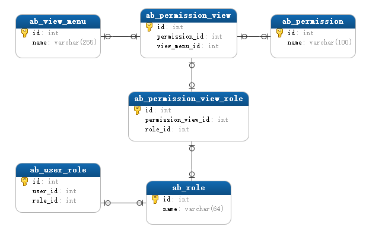

# Superset 二次开发 根据APP控制权限

## 一、背景

- 数据是区分应用维度的，想要控制用户对应用数据的访问权限


综上，需要二次开发，实现基于数据内容的权限控制

## 二、Version

- 系统：Ubuntu
- python版本：3.6
- superset版本： apache-superset==0.36.0
- conda 虚拟环境

## 三、实现

### 1. 思路

- 实现该功能的最终目的就是只返回用户有权限的应用的数据，没有权限的不返回
- Google之后没有发现superset支持类似的功能，或者说在superset的设计理念中就没打算支持这种功能
- 只能二次开发了，最初的思路是直接改源码，在query获取数据时加入有权限的应用的过滤条件；毕竟改源码不是一个很好的办法，改了源码后期维护升级成本都比较高
- 跟前端大牛聊了一下，思路从改底层query的条件改为修改请求的参数；如果能在不修改源码的情况下，修改参数就最好了
- FAB 是提供before_request  `Registers a function to run before each request`,   通过自定义的安全类来实现CUSTOM_SECURITY_MANAGER； superset获取具体的数据是通过/superset/explore_json， 所以修改对应接口的请求参数即可
- 应用维度权限，是根据数据内容来区分权限的；superset权限控制大部分是针对功能的，但是table的权限是具体到每个table的；这块也可以理解成是根据内容来分权限的，所以我们要做的应用权限可以参考table的实现；

### 2. 修改请求参数，在过滤条件中加有权限的应用

```python
import logging
import json
import re

from flask import request, g
from werkzeug.datastructures import ImmutableMultiDict
from superset.security import SupersetSecurityManager

_LOGGER = logging.getLogger(__name__)


class CustomSecurityManager(SupersetSecurityManager):
    def __init__(self, appbuilder):
        """
            SecurityManager contructor
            param appbuilder:
                F.A.B AppBuilder main object
        """
        super().__init__(appbuilder)


    @staticmethod
    def before_request():
        SupersetSecurityManager.before_request()

        try:
            # g.user 获取当前登录的用户
            if not g.user.is_active:
                _LOGGER.info('user is not active')
                return

            # 非explore_json url，不做处理
            # admin app_all 是超级权限，不加用应用过滤；避免应用过多，影响性能
            roles = g.user.roles
            role_names = [role.name for role in roles]
            all_access_roles = ['Admin', 'app_all']
            if request.path.find('explore_json') < 0:
                _LOGGER.info('not request for explore_json')
                return

            if any([name in role_names for name in all_access_roles]):
                _LOGGER.info(f'{g.user.username} has all app access')
                return

            # 当前用户有权限的应用
            apps = set("")
            for role in roles:
                permissions = role.permissions
                for perm in permissions:
                    view_menu_name = perm.view_menu.name
                    patern = re.compile('app_(.*)')
                    match = patern.match(view_menu_name)
                    if match:
                        app = match.groups()[0]
                        apps.add(app)
            apps = list(apps)

            # check 用户访问的应用是否在权限内，不在不返回该应用的数据
            form = request.form.to_dict()
            form_data = json.loads(form['form_data'])
            default_filter = True
            extra_filters = form_data.get('extra_filters', [])
            for filter in extra_filters:
                # 请求条件中有app的，check权限，只返回有权限的应用
                if filter.get('col', None) == 'app':
                    val = filter.get('val', [])
                    # val 为空 ""时， 不处理
                    if not val:
                        continue

                    for v in val:
                        # if v not in apps:
                        if not any([bool(re.search(v, app, re.IGNORECASE)) for app in apps]):
                            val.remove(v)
                            _LOGGER.info(f'{g.user.username} has no access to {v}, pop from filter')

                    if val:
                        default_filter = False
                        _LOGGER.info(f'{g.user.username} app filters is {val}')
                    break

            # 请求不含app的条件时，增加用户有权限的应用
            if default_filter:
                extra_filters.append(
                    {"col":"app","op":"in","val":apps}
                )
                _LOGGER.info(f'{g.user.username} app filters is {apps}')

            form['form_data'] = json.dumps(form_data)
            request.form = ImmutableMultiDict(form)

        except Exception as e:
            _LOGGER.exception(e)

```

### 3. 应用权限控制



- 思路参考table权限的源码 superset/connectors/sqla/views.py:259  TableModelView
- FAB权限相关数据结构如上图，其他的数据可以后期控制台操作，但是view_menu相关的数据要想办法加进去；
  - 对于目前已经存在的应用，可以整理好数据，直接inset到ab_view_menu、ab_permission_view
  - 新增加的应用想办法通过配置加进去，之前已经开发了配置应用信息的功能；需要在新增应用的时候，在ab_view_menu、ab_permission_view中添加记录

```python
import datetime

from flask_appbuilder import ModelView, Model
from superset import security_manager
from sqlalchemy import Column, String, DateTime

class ConfAppsModel(Model):
    """
    应用信息，包括包名、应用名称、应用key等等
    """
    #有多个源的时候，非默认的需要明确指定数据源
    __bind_key__ = _DB_DATAREPORT
    __tablename__ = 'conf_apps'
    app_key = Column(String, nullable=False, primary_key=True, unique=True)
    app_package = Column(String, nullable=False)
    app_name = Column(String, nullable=False)
    comment = Column(String, nullable=False)
    platform = Column(String, nullable=False)
    last_modified = Column(DateTime)

    def __repr__(self):
        return self.app_key
    
    
class ConfAppsView(ModelView):
    """
    应用信息，包括包名、应用名称、应用key等等
    """
    datamodel = SQLAInterface(ConfAppsModel)

    def post_add(self, item):
        # 将新增的应用添加到ad_view_menu
        perm = f'app_{item.app_key}'
        security_manager.add_permission_view_menu("datasource_access", perm)


    post_update = post_add
```

- 后期的应用权限管理同table的权限管理，将权限加到role，然后通过role管理权限即可