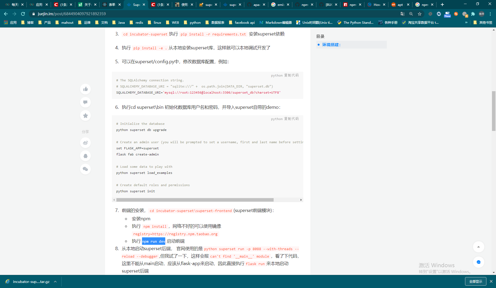

# [Superset]修改FilterBox源码，实现下拉框别名name

## 一、背景

superset提高的filterbox 下拉框选择，不支持别名的形式；即value和name都是一个值，在配置filterbox的时候选择； 并没有提高别名的功能；要实现别名，只能自己二次开发了；


## 二、开发测试环境



conda 安装环境，因为之前已经有装好的环境；此处直接导出环境配置文件，然后安装；开发

```shell
# 环境源机器
conda activate superset
conda env export > environment_superset.yml

# 环境目标机器
# 如果需要修改安装目录和env name， 直接在配置文件里面修改
conda env create -f environment_superset.yml  -u
conda activate superset

# 因为要改前端源码，需要编译，所以1. python使用源码安装； 2. 前端直接在源码修改，然后npm run dev
# 后端安装
# uninstall通过pip安装的superset
pip uninstall apache-superset
# github 下载源码，源码安装superset的python
conda activate superset
python3 setup.py install -f

# 前端安装
apt-get install npm

cd ~/superset_source_code/incubator-superset-0.36/superset-frontend
npm cache clean -f
npm install -g n
n stable
package.json中devDependencies对象添加     "@babel/compat-data": "7.9.0"
npm install
echo fs.inotify.max_user_watches=524288 | sudo tee -a /etc/sysctl.conf && sudo sysctl -p

# 运行
npm run dev
superset run -h 0.0.0.0 -p 8089 --with-threads --reload --debugger

```


## 三、filterbox的整体流程

### 页面配置

1. 页面配置filterbox的相关选项， 可是页面并不支持
2. chart list =>编辑对应的filterbox chart => 修改 Parameters； 此处要对app设置别名name，在对应的配置中增加`"alias": "app_alias"`

```json
{
  "adhoc_filters": [],
  "datasource": "26__table",
  "date_filter": true,
  "filter_configs": [
    {
      "alias": "app_alias",
      "asc": true,
      "clearable": false,
      "column": "app",
      "defaultValue": "",
      "key": "14WbEp8Y9",
      "label": "app",
      "multiple": true
    },
    {
      "asc": true,
      "clearable": true,
      "column": "country",
      "key": "qAxf5Xo1z",
      "label": "country",
      "multiple": true
    },
    {
      "asc": true,
      "clearable": true,
      "column": "ad_manager",
      "key": "6Gh4SY19_",
      "label": "ad_manager",
      "multiple": true
    }
  ],
  "granularity_sqla": null,
  "instant_filtering": true,
  "show_druid_time_granularity": false,
  "show_druid_time_origin": false,
  "show_sqla_time_column": false,
  "show_sqla_time_granularity": false,
  "slice_id": 185,
  "time_range": "Last month",
  "time_range_endpoints": [
    "unknown",
    "inclusive"
  ],
  "url_params": {
    "preselect_filters": "{\"185\": {\"app\": \"\", \"__time_range\": \"Last month : \"}}"
  },
  "viz_type": "filter_box"
}
```
3. `app_alias`这一列如果存在于源表中，是最好的了； 如果不存在，需要自己处理一下源表的SQL； 此处是基于query创建的chart，所以修改了query，新增加一列`app_alias`； 如下：

   ```sql
   SELECT a.app, a.country, a.ad_manager, IFNULL(info.app_name,a.app) app_alias
   FROM
   (
   SELECT  distinct app app,  country, ad_manager
FROM summary_day_country
   WHERE data_time > date_sub(NOW(), interval 15 day)
   ) a
   LEFT OUTER JOIN conf_apps info
   on a.app = info.app_key
   ```
   
   

### 后端数据获取

直接修改superset/viz.py的`FilterBoxViz `类

```python
class FilterBoxViz(BaseViz):

    """A multi filter, multi-choice filter box to make dashboards interactive"""

    viz_type = "filter_box"
    verbose_name = _("Filters")
    is_timeseries = False
    credits = 'a <a href="https://github.com/airbnb/superset">Superset</a> original'
    cache_type = "get_data"
    filter_row_limit = 1000

    def query_obj(self):
        return None

    def run_extra_queries(self):
        qry = super().query_obj()
        filters = self.form_data.get("filter_configs") or []
        qry["row_limit"] = self.filter_row_limit
        self.dataframes = {}
        for flt in filters:
            col = flt.get("column")
            alias = flt.get("alias")
            if not col:
                raise Exception(
                    _("Invalid filter configuration, please select a column")
                )
            qry["groupby"] = [col]
            # 有别名的话，查询别名的数据
            if alias:
                qry["groupby"].append(alias)
            metric = flt.get("metric")
            qry["metrics"] = [metric] if metric else []
            df = self.get_df_payload(query_obj=qry).get("df")
            self.dataframes[col] = df

    def get_data(self, df: pd.DataFrame) -> VizData:
        filters = self.form_data.get("filter_configs") or []
        d = {}
        for flt in filters:
            col = flt.get("column")
            metric = flt.get("metric")
            df = self.dataframes.get(col)
            if df is not None:
                if metric:
                    df = df.sort_values(
                        utils.get_metric_name(metric), ascending=flt.get("asc")
                    )
                    # text的值有别名就取别名对应的列
                    d[col] = [
                        {"id": row[0], "text": row[2] if len(row) >2 else row[0] , "metric": row[1]}
                        for row in df.itertuples(index=False)
                    ]
                else:
                    df = df.sort_values(col, ascending=flt.get("asc"))
                    d[col] = [
                        {"id": row[0], "text": row[1] if len(row) >1 else row[0]}
                        for row in df.itertuples(index=False)
                    ]
        return d
```


### 前端显示

修改superset-frontend/src/visualizations/FilterBox/FilterBox.jsx，`label`显示`text`的值，不再是`id`

```jsx
    return (
      <OnPasteSelect
        placeholder={t('Select [%s]', label)}
        key={key}
        multi={filterConfig.multiple}
        clearable={filterConfig.clearable}
        value={value}
        options={data.map(opt => {
          const perc = Math.round((opt.metric / max) * 100);
          const backgroundImage =
            'linear-gradient(to right, lightgrey, ' +
            `lightgrey ${perc}%, rgba(0,0,0,0) ${perc}%`;
          const style = {
            backgroundImage,
            padding: '2px 5px',
          };
          // return { value: opt.id, label: opt.id, style };
          return { value: opt.id, label: opt.text, style };
        })}
        onChange={(...args) => {
          this.changeFilter(key, ...args);
        }}
        onFocus={this.onFocus}
        onBlur={this.onBlur}
        onOpen={(...args) => {
          this.onFilterMenuOpen(key, ...args);
        }}
        onClose={this.onFilterMenuClose}
        selectComponent={Creatable}
        selectWrap={VirtualizedSelect}
        optionRenderer={VirtualizedRendererWrap(opt => opt.label)}
        noResultsText={t('No results found')}
      />
    );
```


## 四、上线

- [x] 修改viz.py， check `http://172.18.0.1:8087/superset/explore_json/?form_data=%7B%22slice_id%22%3A185%7D`是否返回有效值

- [x] 本地修改jsx文件，npm run build，替换superset static的文件，check前端页面是否正常

  - [ ] 切新的前端代码之后，页面奔溃，出现大量的js 404
  - [ ] 是因为没有重启的原因，需要重启服务
  
- [x] 修改filter对应的query语句

  ```mysql
SELECT a.app, a.country, a.ad_manager, IFNULL(info.app_name,a.app) app_alias
  FROM
(
SELECT  distinct app app,  country, ad_manager
FROM summary_day_country
  WHERE data_time > date_sub(NOW(), interval 15 day)
) a
  LEFT OUTER JOIN conf_apps info
  on a.app = info.app_key
  ```

- [x] 修改filter的配置，增加alias配置

  ```      "alias": "app_alias",```

## 五、其他地方需要使用filter 别名的操作

1. 修改filter的配置，增加alias配置

```      "alias": "app_alias",```

2. 修改filter对应的query语句，select的结果需要输出alias对应的列

  ```mysql
SELECT a.app, a.country, a.ad_manager, IFNULL(info.app_name,a.app) app_alias
  FROM
(
SELECT  distinct app app,  country, ad_manager
FROM summary_day_country
  WHERE data_time > date_sub(NOW(), interval 15 day)
) a
  LEFT OUTER JOIN conf_apps info
  on a.app = info.app_key
  ```