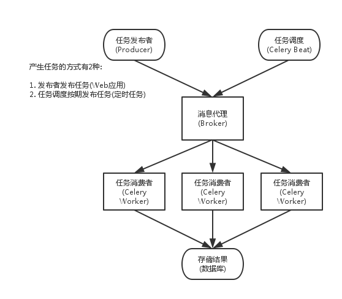

# celery学习笔记

## 整体架构

1. Celery Beat：任务调度器，Beat进程会读取配置文件的内容，周期性地将配置中到期需要执行的任务发送给任务队列。
2. Producer：调用了Celery提供的API、函数或者装饰器而产生任务并交给任务队列处理的都是任务生产者。
3. Broker：消息代理，或者叫作消息中间件，接受任务生产者发送过来的任务消息，存进队列再按序分发给任务消费方（**通常是消息队列或者数据库**）。
4. Celery Worker：执行任务的消费者，通常会在多台服务器运行多个消费者来提高执行效率。
5. Result Backend：任务处理完后保存状态信息和结果，以供查询。

Celery默认已支持Redis、RabbitMQ、MongoDB、Django ORM、SQLAlchemy等方式。

## 关于 --app  参数

使用 --app 参数可也指定运行的 Celery 应用程序实例，格式必须为 `module.path:attribute`

但如果只设置包名，它将进行搜索app实例，顺序如下：

用 --app=proj：

1. 名为 `proj.app` 的属性

2. 名为 `proj.celery` 的属性

3. 模块 `proj` 中值为 Celery 应用程序的任何属性，如果还没有找到，将尝试检索名为 `proj.celery`的子模块

4. 名为 `proj.celery.app` 的属性

5. 名为 `proj.celery.celery` 的属性

6. 模块 `proj.celery` 中值为 Celery 应用程序的任何属性

7. 在此方案模仿文档中使用的实例，即 针对单个模块包含的`proj:app` ，以及 大型项目的 `proj.celery:app`

   

## 多台机器启动worker

https://docs.celeryproject.org/en/stable/userguide/routing.html

## 未知

结果存储

- AMQP、 Redis
- Memcached
- SQLAlchemy、Django ORM
- Apache Cassandra、Elasticsearch

并发

- prefork (multiprocessing)
- [Eventlet](http://eventlet.net/)、[gevent](http://www.gevent.org/)
- solo (single threaded)

序列化

- pickle、json、yaml、msgpack
- zlib、bzip2 compression
- Cryptographic message signing

- 监控

可以针对整个流程进行监控，内置的工具或可以实时说明当前集群的概况。[更多......]()

- 调度

可以通过调度功能在一段时间内指定任务的执行时间 datetime，也可以根据简单每隔一段时间进行执行重复的任务，支持分钟、小时、星期几，也支持某一天或某一年的Crontab表达式。更多......

- 工作流

可以通过“canvas“进行组成工作流，其中包含分组、链接、分块等等。

简单和复杂的工作流程可以使用一组“canvas“组成，其中包含分组、链接、分块等。更多......

- 资源（内存）泄漏保护

--max-tasks-per-child 参数适用于可能会出现资源泄漏（例如：内存泄漏）的任务。更多......

- 时间和速率的限制

您可以控制每秒/分钟/小时执行任务的次数，或者任务执行的最长时间，也将这些设置为默认值，针对特定的任务或程序进行定制化配置。更多......

- 自定义组件

开发者可以定制化每一个职程（Worker）以及额外的组件。职程（Worker）是用 “bootsteps” 构建的-一个依赖关系图，可以对职程（Worker）的内部进行细粒度控制。