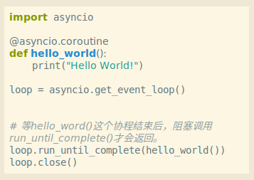
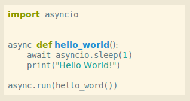
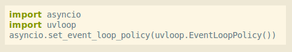

# Python的异步IO

异步IO的优势显而易见，各种语言都通过实现这个机制来提高自身的效率，Python也不例外。

## 一、Python 2的异步IO库
Python 2 时代官方并没有异步IO的支持，但是有几个第三方库通过事件或事件循环（Event Loop）实现了异步IO，它们是：

twisted: 是事件驱动的网络库
gevent: greenlet + libevent(后来是libev或libuv）。通过协程（greenlet）和事件循环库（libev，libuv）实现的gevent使用很广泛。
tornado: 支持异步IO的web框架。自己实现了IOLOOP。

## 二、Python 3 官方的异步IO

Python 3.4 加入了asyncio 库，使得Python有了支持异步IO的官方库。这个库，底层是事件循环（EventLoop），上层是协程和任务。asyncio自从3.4 版本加入到最新的 3.7版一直在改进中。

Python 3.4 刚开始的asyncio的协程还是基于生成器的，通过 yield from 语法实现，可以通过装饰器 @asyncio.coroutine （已过时）装饰一个函数来定义一个协程。比如：

Python 3.5 引入了两个新的关键字 await 和 async 用来替换 @asyncio.coroutine 和 yield from ，从语言本身来支持异步IO。从而使得异步编程更加简洁，并和普通的生成器区别开来。

注意： 对基于生成器的协程的支持已弃用，并计划在 Python 3.10 中移除。所以，写异步IO程序时只需使用 async 和 await 即可。

Python 3.7 又进行了优化，把API分组为高层级API和低层级API。 我们先看看下面的代码，发现与上面的有什么不同？

除了用 async 替换 @asyncio.coroutine 和用 await 替换 yield from 外，最大的变化就是关于eventloop的代码不见了，只有一个 async.run()。这就是 3.7 的改进，把eventloop相关的API归入到低层级API，新引进run()作为高层级API让写应用程序的开发者调用，而不用再关心eventloop。除非你要写异步库（比如MySQL异步库）才会和eventloop打交道。

需要注意的是， async.run() 是3.7版新增加的，处于暂定API状态。 暂定API，是指被有意排除在标准库的向后兼容性保证之外的应用编程接口。虽然此类接口通常不会再有重大改变，但只要其被标记为暂定，就可能在核心开发者确定有必要的情况下进行向后不兼容的更改（甚至包括移除该接口）。此种更改并不会随意进行 — 仅在 API 被加入之前未考虑到的严重基础性缺陷被发现时才可能会这样做。即便是对暂定 API 来说，向后不兼容的更改也会被视为“最后的解决方案” —— 任何问题被确认时都会尽可能先尝试找到一种向后兼容的解决方案。这种处理过程允许标准库持续不断地演进，不至于被有问题的长期性设计缺陷所困。

从上面关于 asyncio 的发展来看它一直在变化，3.4，3.5，3.6， 3.7 都有很多细节上的变化。当我看到3.7的run()函数时，也发现一年前基于3.6的asnycio写的爬虫不那么优雅了。

这种变化，一方面改善了asyncio本身的性能和使用方便程度，但另一方面也增加了我们使用者的学习成本、Python升级带来的改造的成本。如果你以消极的态度抵制这种变化，可以去学习golang，C++来实现你的程序；如果你以积极的态度迎接这种变化，可以更快的掌握这种变化，并优雅 高效的实现你的程序。

只要你喜欢用Python写程序解决问题，那么就接受并掌握这种变化吧。其实，那种语言不在变，那种技术不在前进。作为程序员，你只有不断地学习和前进。

## 三、uvloop

uvloop是用Cython写的，基于libuv这个C语言实现的高性能异步I/O库。asyncio自己的事件循环是用Python写的，用uvloop替换asyncio自己的事件循环可以使asyncio的速度更快。并且使用相当简洁：

## 四、总结
1. 异步IO用在费时的IO操作上以提高程序整体效率。

2. 同步和异步，阻塞和非阻塞就是方法和现象。

3. Python的异步历史很复杂，然而目前给我们用的已经很优雅，记住以下三点：

   - Python 3.7

   - await，async
   - IO的时候用

