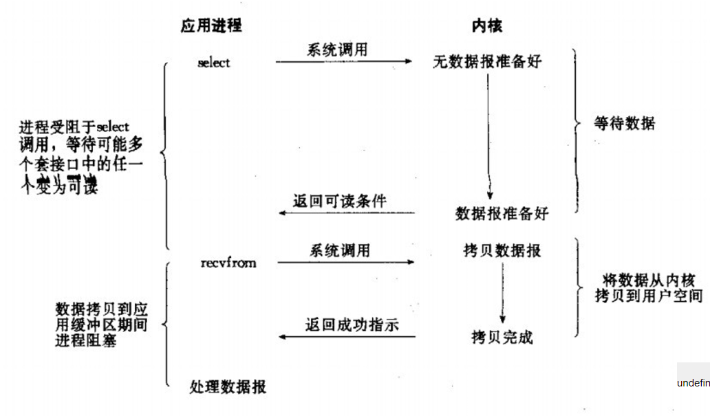
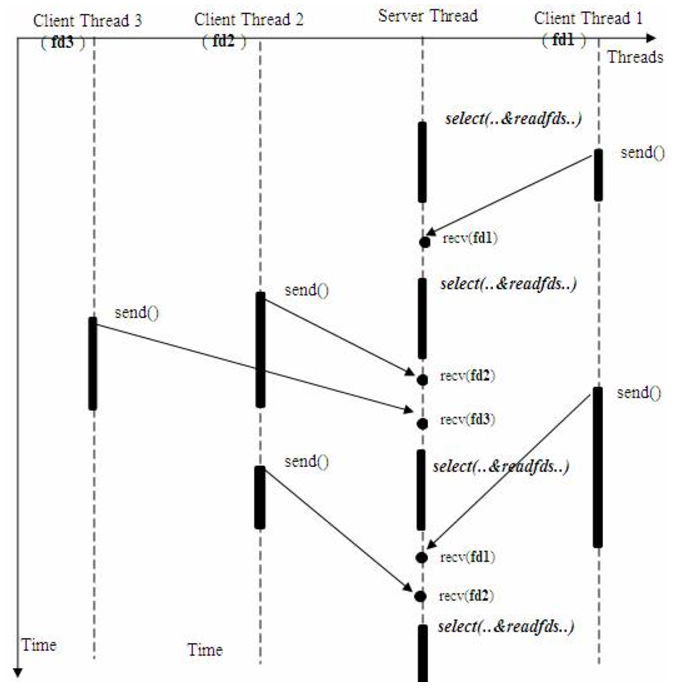

# [python异步] Linux 多路复用IO模型 Select,Poll,Epoll 对比
[TOC]

操作系统在处理io的时候，主要有两个阶段：

- 等待数据传到io设备
- io设备将数据复制到user space

我们一般将上述过程简化理解为：

- 等到数据传到kernel内核space
- kernel内核区域将数据复制到user space（理解为进程或者线程的缓冲区）

而根据这两个阶段而不同的操作方法，就会产生多种io模型，本文只讨论select，poll，epoll，所以只引出三种io模型。

# 一、细谈 io 多路复用技术 select 和poll

## Select介绍

select的工作流程： 单个进程就可以同时处理多个网络连接的io请求（同时阻塞多个io操作）。基本原理就是程序呼叫select，然后整个程序就阻塞了，这时候，kernel就会轮询检查所有select负责的fd，当找到一个client中的数据准备好了，select就会返回，这个时候程序就会系统调用，将数据从kernel复制到进程缓冲区。

下图为select同时从多个客户端接受数据的过程

虽然服务器进程会被select阻塞，但是select会利用内核不断轮询监听其他客户端的io操作是否完成。

## Poll介绍

poll的原理与select非常相似，差别如下：

- 描述fd集合的方式不同，poll使用 pollfd 结构而不是select结构fd_set结构，所以poll是链式的，没有最大连接数的限制
- poll有一个特点是水平触发，也就是通知程序fd就绪后，这次没有被处理，那么下次poll的时候会再次通知同个fd已经就绪。

## Select、Poll 的缺点

- 根据fd_size的定义，它的大小为32个整数大小（32位机器为32*32，所有共有1024bits可以记录fd），每个fd一个bit，所以最大只能同时处理1024个fd（select有这个限制，poll没有）

- 每次要判断【有哪些event发生】这件事的成本很高，因为select（polling也是）采取主动轮询机制

  

## Select、Poll 的轮询过程

1. 每一次呼叫 select( ) 都需要先从 user space把 FD_SET复制到 kernel（约线性时间成本） 为什么 select 不能像epoll一样，只做一次复制就好呢? 每一次呼叫 select()前，FD_SET都可能更动，而 epoll 提供了共享记忆存储结构，所以不需要有 kernel 與 user之间的数据沟通

2. kernel还要轮询每个fd，约线性时间

   - 假设现实中，有1百万个客户端同时与一个服务器保持着tcp连接，而每一个时刻，通常只有几百上千个tcp连接是活跃的，这时候我们仍然使用select/poll机制，kernel必须在搜寻完100万个fd之后，才能找到其中状态是active的，这样资源消耗大而且效率低下。

对于select和poll的上述缺点，就引进了一种新的技术，epoll技术

# 二、细谈事件驱动--Epoll

## Epoll提供了三个函数：

1. int epoll_create(int size); 建立一個 epoll 对象，并传回它的id
2. int epoll_ctl(int epfd, int op, int fd, struct epoll_event *event); 事件注册函数，将需要监听的事件和需要监听的fd交给epoll对象
3. int epoll_wait(int epfd, struct epoll_event *events, int maxevents, int timeout); 等待注册的事件被触发或者timeout发生

## Epoll解决的问题：

- epoll没有fd数量限制 epoll没有这个限制，我们知道每个epoll监听一个fd，所以最大数量与能打开的fd数量有关，一个g的内存的机器上，能打开10万个左右
- **epoll不需要每次都从user space 将fd set复制到内核kernel epoll在用epoll_ctl函数进行事件注册的时候，已经将fd复制到内核中，所以不需要每次都重新复制一次**
- select 和 poll 都是主动轮询机制，需要拜訪每一個 FD； epoll是被动触发方式，给fd注册了相应事件的时候，我们为每一个fd指定了一个回调函数，当数据准备好之后，就会把就绪的fd加入一个就绪的队列中，epoll_wait的工作方式实际上就是在这个就绪队列中查看有没有就绪的fd，如果有，就唤醒就绪队列上的等待者，然后调用回调函数。
- 虽然epoll、poll、select都需要查看是否有fd就绪，但是epoll之所以是被动触发，就在于它只要去查找就绪队列中有没有fd，**就绪的fd是主动加到队列中**，epoll不需要一个个轮询确认。 换一句话讲，就是select和poll只能通知有fd已经就绪了，但不能知道究竟是哪个fd就绪，所以select和poll就要去主动轮询一遍找到就绪的fd。而epoll则是不但可以知道有fd可以就绪，而且还具体可以知道就绪fd的编号，所以直接找到就可以，不用轮询。

# 总结

- select, poll是为了解決同时大量IO的情況（尤其网络服务器），但是**随着连接数越多，性能越差**
- epoll是select和poll的改进方案，在 linux 上可以取代 select 和 poll，**可以处理大量连接的性能问题**

推荐阅读：https://blog.csdn.net/xiexievv/article/details/44976215

