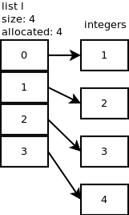

# [python数据结构] 列表底层原理

## 前言

```
Another generally useful object type is a list of object pointers.
This is a mutable type: the list items can be changed, and items can be
added or removed.  Out-of-range indices or non-list objects are ignored.
```

开局一段注释：

- 对象指针列表:`a list of object pointers.`
- 可以增删改查:`the list items can be changed, and items can be
  added or removed`
- 具有索引容错功能：`Out-of-range indices or non-list objects are ignored.`

## PyListObject

```
// listobject.h.23
typedef struct {
    PyObject_VAR_HEAD
    PyObject **ob_item;
    Py_ssize_t allocated;
} PyListObject;

/* ob_item contains space for 'allocated' elements.  The number
 * currently in use is ob_size.
 * Invariants:
 *     0 <= ob_size <= allocated
 *     len(list) == ob_size
 *     ob_item == NULL implies ob_size == allocated == 0
 * list.sort() temporarily sets allocated to -1 to detect mutations.
 *
 * Items must normally not be NULL, except during construction when
 * the list is not yet visible outside the function that builds it.
 */
```

如上，其中的注释很有用，其他信息：

- `**ob_item` 明确是指向列表元素的指针列表

- allocated 在内存中分配的插槽数，标识容器大小，决定了内存大小

- ob_size 标记了元素个数


## **List 初始化过程**

当一个空数组初始化时，发生了什么

```c
arguments: size of the list = 0
returns: list object = []
PyListNew:
    nbytes = size * size of global Python object = 0
    allocate new list object
    allocate list of pointers (ob_item) of size nbytes = 0
    clear ob_item
    set list's allocated var to 0 = 0 slots
    return list object 
```

重要的是要注意**分配的插槽和列表大小之间的差异**。 **列表的大小与len（l）相同**。 **分配的插槽数是已在内存中分配的数量**。 通常，您会看到分配的大小可能大于size。 这是为了避免**每次将新元素添加到列表时都需要调用realloc**。 稍后我们将详细介绍。

## **Append**

当我们建一个integer追加到list中，`l.append(1)`，将会发生什么？ 一个C内部方法 app1() 会被调用。

```c
arguments: list object, new element
returns: 0 if OK, -1 if not
app1:
    n = size of list
    call list_resize() to resize the list to size n+1 = 0 + 1 = 1
    list[n] = list[0] = new element
    return 0
```


观察下 `list_resize()`，**它过度分配了内存以避免调用list_resize太多时间**。 列表的增长方式为：0、4、8、16、25、35、46、58、72、88，...

```c
arguments: list object, new size
returns: 0 if OK, -1 if not
list_resize:
    new_allocated = (newsize >> 3) + (newsize < 9 ? 3 : 6) = 3
    new_allocated += newsize = 3 + 1 = 4
    resize ob_item (list of pointers) to size new_allocated
    return 0
```

现在分配了4个slot来包含元素，第一个slot是整数1。您可以在下图中看到l [0]指向我们刚刚附加的整数对象。 **虚线正方形表示已分配但尚未使用的插槽**。

Appand 操作的时间复杂度 O(1)


我们继续添加一个元素：l.append（2）。 使用n + 1 = 2调用list_resize，但是由于分配的大小为4，因此无需分配更多的内存。 当我们再添加2个整数时，也会发生同样的事情：l.append（3），l.append（4）。 下图显示了到目前为止的内容。





## **Insert**

让我们在位置1处插入一个新的整数（5）：l.insert（1,5），看看内部发生了什么。 函数ins1() 被调用

```text
arguments: list object, where, new element
returns: 0 if OK, -1 if not
ins1:
    resize list to size n+1 = 5 -> 4 more slots will be allocated
    starting at the last element up to the offset where, right shift each element 
    set new element at offset where
    return 0
```


虚线正方形表示已分配但尚未使用的插槽。 在这里，分配了8个插槽，但列表的大小或长度仅为5。

Insert 操作的复杂度为O(n)

## **Pop**

当您弹出最后一个元素：l.pop（）时，将调用listpop()。 在listpop()内部调用list_resize，**如果新大小小于分配大小的一半，则列表将缩小**。

```c
arguments: list object
returns: element popped
listpop:
    if list empty:
        return null
    resize list with size 5 - 1 = 4. 4 is not less than 8/2 so no shrinkage
    set list object size to 4
    return last element
```

Pop 操作的复杂度为 O(1).


您可以看到插槽4仍指向整数，但重要的是列表的大小现在为4。

让我们再弹出一个元素。 在list_resize()中，size – 1 = 4 – 1 = 3小于分配的插槽的一半，因此列表缩小为6个插槽，并且列表的新大小现在为3。

您可以观察到插槽3和4仍指向一些整数，但重要的是列表的大小现在为3。


## **Remove**

Python列表对象具有删除特定元素的方法：l.remove（5）。底层函数 listremove() 被调用。

```c
arguments: list object, element to remove
returns none if OK, null if not
listremove:
    loop through each list element:
        if correct element:
            slice list between element's slot and element's slot + 1
            return none
    return null
```

要切片列表并删除元素，将调用list_ass_slice()，很有趣的是它如何工作。 在这里，低偏移量是1，高偏移量是2，因为我们要删除位置1处的元素5。

```c
arguments: list object, low offset, high offset
returns: 0 if OK
list_ass_slice:
    copy integer 5 to recycle list to dereference it
    shift elements from slot 2 to slot 1
    resize list to 5 slots
    return 0
```

Remove操作的复杂度为O(n).


### 内存的占用

```python
l = [0,1,2,3]
l.remove(3)
l = [0,1,2,3]
id(l)
1615362835592
id(l[0])
1349025872
id(l[1])
1349025904
l1 = [0,1,2,3]
id(l1)
1615362788744
id(l)
1615362835592
l.extend(l1)
id(l)
1615362835592
l.extend(l1*100)
id(l)
1615362835592
l.extend(l1*10000000)
id(l)
1615362835592
l.extend(l1*10000000)
l.extend(l1*10000000)
l.extend(l1*10000000)
l.extend(l1*10000000)
id(l)
1615362835592
```

**列表对象（非元素）占用的内存地址是连续的，并不随着元素增加而改变**

元素的地址很显然不会是连续的，所以未写代码测试


### 总结

1. **为了避免每次新增元素时，分配空间，指针列表存在过度分配的现象；删除元素时，当元素实际个数小于插槽个数的一半时，缩小指针列表**
2. **列表元素的增删改查实际上都是在操作指针列表，时间复杂度都是操作指针的复杂度**