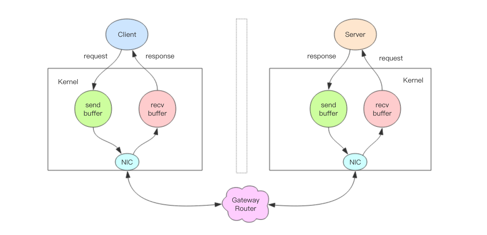

# Redis管道技术

Redis客户端与服务器之间使用TCP协议进行通信，并且很早就支持管道（pipelining）技术了。在某些高并发的场景下，网络开销成了Redis速度的瓶颈，所以需要使用管道技术来实现突破。

在介绍管道之前，先来想一下单条命令的执行步骤：

- 客户端把命令发送到服务器，然后阻塞客户端，等待着从socket读取服务器的返回结果
- 服务器处理命令并将结果返回给客户端

按照这样的描述，每个**命令的执行时间 = 客户端发送时间+服务器处理和返回时间+一个网络来回的时间**

其中一个网络来回的时间是不固定的，它的决定因素有很多，比如客户端到服务器要经过多少跳，网络是否拥堵等等。但是这个时间的量级也是最大的，也就是说一个命令的完成时间的长度很大程度上取决于网络开销。如果我们的服务器每秒可以处理10万条请求，而网络开销是250毫秒，那么实际上每秒钟只能处理4个请求。最暴力的优化方法就是使客户端和服务器在一台物理机上，这样就可以将网络开销降低到1ms以下。但是实际的生产环境我们并不会这样做。而且即使使用这种方法，当请求非常频繁时，这个时间和服务器处理时间比较仍然是很长的。

## Redis Pipelining

为了解决这种问题，Redis在很早就支持了管道技术。**也就是说客户端可以一次发送多条命令，不用逐条等待命令的返回值，而是到最后一起读取返回结果，这样只需要一次网络开销**，速度就会得到明显的提升。管道技术其实已经非常成熟并且得到广泛应用了，例如POP3协议由于支持管道技术，从而显著提高了从服务器下载邮件的速度。

在Redis中，**如果客户端使用管道发送了多条命令，那么服务器就会将多条命令放入一个队列中，这一操作会消耗一定的内存，所以管道中命令的数量并不是越大越好（太大容易撑爆内存），而是应该有一个合理的值**。

## 深入理解Redis交互流程

管道并不只是用来网络开销延迟的一种方法，**它实际上是会提升Redis服务器每秒操作总数的**。在解释原因之前，需要更深入的了解Redis命令处理过程。

[](https://res.cloudinary.com/dxydgihag/image/upload/v1556373614/Blog/Redis/pipeline/command.png)

一个完整的交互流程如下：

1. 客户端进程调用`write()`把消息写入到操作系统内核为Socket分配的send buffer中
2. 操作系统会把send buffer中的内容写入网卡，网卡再通过网关路由把内容发送到服务器端的网卡
3. 服务端网卡会把接收到的消息写入操作系统为Socket分配的recv buffer
4. 服务器进程调用`read()`读取消息然后进行处理
5. 处理完成后调用`write()`把返回结果写入到服务器端的send buffer
6. 服务器操作系统再将send buffer中的内容写入网卡，然后发送到客户端
7. 客户端操作系统将网卡内容读到recv buffer中
8. 客户端进程调用`read()`从recv buffer中读取消息并返回

现在我们把命令执行的时间进一步细分：

**命令的执行时间 = 客户端调用write并写网卡时间+一次网络开销的时间+服务读网卡并调用read时间++服务器处理数据时间+服务端调用write并写网卡时间+客户端读网卡并调用read时间**

这其中除了网络开销，花费时间最长的就是**进行系统调用`write()`和`read()`了**，这一过程需要操作系统由用户态切换到内核态，中间涉及到的上下文切换会浪费很多时间。

使用管道时，多个命令只会进行一次`read()`和`wrtie()`系统调用，因此使用管道会提升Redis服务器处理命令的速度，随着管道中命令的增多，服务器每秒处理请求的数量会线性增长，最后会趋近于不使用管道的10倍。

[](https://res.cloudinary.com/dxydgihag/image/upload/v1556376029/Blog/Redis/pipeline/pipeline_iops.png)

## 和Scripting对比

对于管道的大部分应用场景而言，使用Redis脚本（Redis2.6及以后的版本）会使服务器端有更好的表现。使用脚本最大的好处就是可以以最小的延迟读写数据。

有时我们也需要在管道中使用EVAL和EVALSHA命令，这是完全有可能的。因此Redis提供了SCRIPT LOAD命令来支持这种情况。

## 用python使用管道批量写入IP

```python
import redis

_redis = redis.Redis(host='localhost', port='6379', db=10)

def init_ip():
    """
    初始化需要check的IP
    :return:
    """
    cnt = 0
    num = 0
    p = _redis.pipeline(transaction=False)
    with open(_ip_file, 'r') as f_ip:
        for ip in f_ip:
            if cnt < 50000:
                ip = ip.strip().split()[0]
                p.lpush('ip_ready'+str(num),ip)
                cnt += 1
            else:
                p.execute()

                p = _redis.pipeline(transaction=False)
                cnt = 0
                num += 1

```

## 总结

1. 使用管道技术可以显著提升Redis处理命令的速度；其原理就是将多条命令打包，只需要一次网络开销、在服务器端和客户端各一次`read()`和`write()`系统调用，以此来节约时间。
2. 管道中的命令数量要适当，并不是越多越好，太多会消耗Redis的内存。
3. 在Redis前面使用一个代理，可以负载以及高可用；如Codis 的使用
4. Redis2.6版本以后，脚本在大部分场景中的表现要优于管道。

## redis官网提到的扩展

前面我们提到，为了解决网络开销带来的延迟问题，可以把客户端和服务器放到一台物理机上。但是有时用benchmark进行压测的时候发现这仍然很慢。

这时客户端和服务端实际是在一台物理机上的，所有的操作都在内存中进行，没有网络延迟，按理来说这样的操作应该是非常快的。为什么会出现上面的情况的呢？

实际上，这是由内核调度导致的。比如说，benchmark运行时，读取了服务器返回的结果，然后写了一个新的命令。这个命令就在回环接口的send buffer中了，如果要执行这个命令，内核需要唤醒Redis服务器进程。所以在某些情况下，本地接口也会出现类似于网络延迟的延迟。其实是内核特别繁忙，一直没有调度到Redis服务器进程。

另外，就算是在一台物理机上，因为是socket交互，任然需要频繁系统调用`write()`和`read()`吧？

## 工具

 redis提供了`redis-benchmark`工具测试性能


参考：

[Redis官方文档](https://redis.io/topics/pipelining)

[速度不够，管道来凑——Redis管道技术](https://jackeyzhe.github.io/2019/04/27/%E9%80%9F%E5%BA%A6%E4%B8%8D%E5%A4%9F%EF%BC%8C%E7%AE%A1%E9%81%93%E6%9D%A5%E5%87%91%E2%80%94%E2%80%94Redis%E7%AE%A1%E9%81%93%E6%8A%80%E6%9C%AF/)

[Redis Pipeline原理分析](http://www.cnblogs.com/jabnih/)