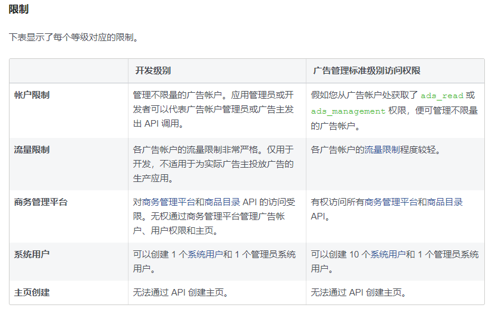

#  Facebook Marketing API 调研

## 一、主要功能

- https://developers.facebook.com/docs/marketing-api/using-the-api
- 广告成效分析
- 受众管理
- 广告管理

## 二、 python SDK 的使用

https://github.com/facebook/facebook-python-business-sdk

SDK 可以实现上面的功能

各种功能demo

## 三、访问权限token 获取

指南链接

https://developers.facebook.com/docs/marketing-api/access

打开链接，生成token https://developers.facebook.com/products/marketing-api/async/get-started/dialog/


尝试点：

使用系统账号的token，开通ad_reads 的权限，以管理员身份运行获取当前app 的广告成效数据


## 四、快速入门

https://developers.facebook.com/docs/marketing-api/buying-api


## 五、请求限制

### 1. 单次请求的限制

限制点：

	- 单次请求的数据条数
	- 获取单次请求数据的数据节点数

规避的方式：

	- 缩小时间范围
	- 减少不必要的指标
	- 逐级获取数据，如遍历一个账号下的所有campaign分多次获取，而不是一次都获取

### 2. ads API访问的次数限制（每小时）

- 在控制台的app dashboard 可以看到当前使用量和余量

- 是按账号区分的，每个账号的实际请求次数、每小时能请求的最大次数 都是相互独立的
- 最大请求数跟各个账号下活跃的广告数有关，见红色框框的公式


### 3. 不同账号级别的访问权限限制



### 4. facebook其他API的调用次数限制

关于应用程序级别的速率限制

速率限制定义了在指定时间段内可以进行多少个API调用的限制。应用程序级别的速率限制适用于使用除页面访问令牌和广告API调用以外的任何访问令牌进行的调用。您的应用每小时可拨打的电话总数是用户数量的200倍。请注意，这不是每个用户的限制。只要所有用户的总数不超过应用程序的最大值，任何单个用户每小时可以拨打200个以上的电话。

- 即所有用户请求的总次数不能超过 200*用户数，单个用户请求次数可以超过200，不200*用户总数  即可

## 六、异步请求

```python
from facebookads.adobjects.campaign import Campaign
from facebookads.adobjects.adsinsights import AdsInsights
from facebookads.adobjects.adreportrun import AdReportRun
import time

campaign = Campaign(<CAMPAIGN_ID>)

params = {
    'level': AdsInsights.Level.campaign,
}
async_job = campaign.get_insights(params=params, async=True)
async_job.api_get()
while async_job[AdReportRun.Field.async_percent_completion] < 100:
    time.sleep(1)
    async_job.api_get()
    time.sleep(1)
    print(async_job.get_result())
    
```


## 七、时区

We report ad insights data in the ad account's timezone. To retrieve insights data for the associated ad account daily, consider the time of day using the account timezone. This helps pace queries throughout the day.

即使用广告账号的时区


## 字段

细分可用字段：

当前product_id不可用

country、hourly_stats_aggregated_by_audience_time_zone只能单独使用，不能一起用


```python
# 'breakdowns': ['product_id', 'country', 'hourly_stats_aggregated_by_audience_time_zone'],
```

以下field都没有值返回：

```python
    'conversions',
    'conversion_values',
    'mobile_app_purchase_roas',
    'purchase_roas',
    'unique_actions',
```

cost_per_action_type 因为获取了应用id就无法获取到这个值，这个值后期计算spend/mobile_app_install

- [ ] 

  


## 疑点

- ## Creative的使用

- user、account、campaign、ad set、ad

- ```python
  fields = [
  ]
  params = {
    adobjects.Campaign.Field.name : 'Conversions Campaign',
      #这个状态的使用
    adobjects.Campaign.Field.configured_status: adobjects.Campaign.Status.paused,
  }
  campaign = AdAccount(id).create_campaign(fields, params)
  
  
  
  
  ```

- fields\params 的区别
- 


## 功能点

1. 分国家、产品、每小时整理Facebook控制台数据， 判断获客成本； 同时还需要手动去拿admobe的收入判断用户质量
2. 