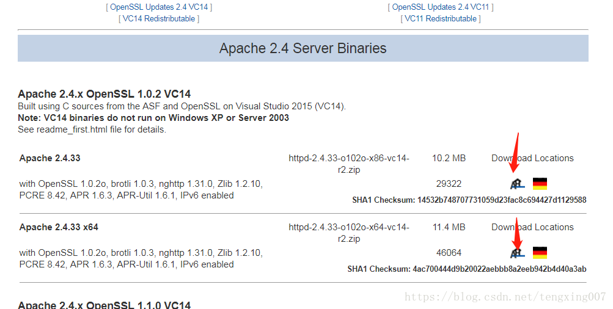

# window 使用ab压力测试http服务

## 1. 下载安装

下载地址：[(](https://www.apachehaus.com/cgi-bin/download.plx)https://www.apachehaus.com/cgi-bin/download.plx)



- 解压


- 将解压的bin目录添加到环境变量

## 2. 测试

```
ab -n 100 -c 10 http://test_url
# -n 表示请求数，-c 表示并发数. -t 表示多少s内并发和请求
```

文档在此:http://httpd.apache.org/docs/2.0/programs/ab.html

## 3.  结果

```

C:\Users\Administrator\Downloads\httpd-2.4.33-o102o-x64-vc14-r2\Apache24\bin>ab -n 1000 -c 1000  http://192.168.3.162:888/***/tableauServlet
This is ApacheBench, Version 2.3 <$Revision: 1826891 $>
Copyright 1996 Adam Twiss, Zeus Technology Ltd, http://www.zeustech.net/
Licensed to The Apache Software Foundation, http://www.apache.org/

Benchmarking 192.168.3.162 (be patient)
Completed 100 requests
Completed 200 requests
Completed 300 requests
Completed 400 requests
Completed 500 requests
Completed 600 requests
Completed 700 requests
Completed 800 requests
Completed 900 requests
Completed 1000 requests
Finished 1000 requests


Server Software:
Server Hostname:        192.168.37.162
Server Port:            8999


#请求url
Document Path:          /***/tableauServlet
#页面数据/返回的数据量
Document Length:        63 bytes


#并发数
Concurrency Level:      1000
#共使用了多少时间 
Time taken for tests:   13.182 seconds
#完成请求数
Complete requests:      1000
#失败请求
Failed requests:        0
 
#总共传输字节数，包含http的头信息等
Total transferred:      287000 bytes
#html字节数，实际的页面传递字节数
HTML transferred:       63000 bytes
#每秒多少请求，这个是非常重要的参数数值，服务器的吞吐量
Requests per second:    75.86 [#/sec] (mean)
#用户平均请求等待时间
Time per request:       13181.754 [ms] (mean)
##服务器平均处理时间，也就是服务器吞吐量的倒数
Time per request:       13.182 [ms] (mean, across all concurrent requests)
#每秒获取的数据长度
Transfer rate:          21.26 [Kbytes/sec] received


##连接的最小时间，平均值，中值，最大值
Connection Times (ms)
              min  mean[+/-sd] median   max
Connect:        4   13 117.5      6    3005
##处理时间66
Processing:    84 7105 4444.4   7583   13086
##等待时间
Waiting:       22 7049 4464.0   7532   13059
##合计时间
Total:         91 7118 4442.9   7589   13092


Percentage of the requests served within a certain time (ms)
  50%   7589
  ## 50%的请求在7589ms内返回 
  66%   9792
  ## 66%的请求在9792ms内返回 
  75%  11526
  80%  11832
  90%  12460
  95%  12778
  98%  12962
  99%  13024
 100%  13092 (longest request)

```


## 4. 语法

```

Usage: ab [options] [http[s]://]hostname[:port]/path
用法：ab [选项] 地址

选项：
Options are:
    -n requests    #执行的请求数，即一共发起多少请求。
    -c concurrency    #请求并发数。
    -t timelimit    #测试所进行的最大秒数。其内部隐含值是-n 50000，它可以使对服务器的测试限制在一个固定的总时间以内。默认时，没有时间限制。
    -s timeout    #指定每个请求的超时时间，默认是30秒。
    -b windowsize    #指定tcp窗口的大小，单位是字节。
    -B address    #指定在发起连接时绑定的ip地址是什么。
    -p postfile    #指定要POST的文件，同时要设置-T参数。
    -u putfile    #指定要PUT的文件，同时要设置-T参数。
    -T content-type    #指定使用POST或PUT上传文本时的文本类型，默认是'text/plain'。
    -v verbosity    #设置详细模式等级。
    -w    #将结果输出到html的表中。
    -i    #使用HEAD方式代替GET发起请求。
    -y attributes    #以表格方式输出时，设置html表格tr属性。 
    -z attributes    #以表格方式输出时，设置html表格th或td属性。
    -C attribute    #添加cookie,比如'Apache=1234'。（可重复）
    -H attribute    #为请求追加一个额外的头部，比如'Accept-Encoding: gzip'。（可重复）
    -A attribute    #对服务器提供BASIC认证信任。用户名和密码由一个:隔开，并以base64编码形式发送。无论服务器是否需要(即,是否发送了401认证需求代码)，此字符串都会被发送。
    -P attribute    #对一个中转代理提供BASIC认证信任。用户名和密码由一个:隔开，并以base64编码形式发送。无论服务器是否需要(即, 是否发送了401认证需求代码)，此字符串都会被发送。
    -X proxy:port   #指定代理服务器的IP和端口。
    -V              #打印版本信息。
    -k              #启用HTTP KeepAlive功能，即在一个HTTP会话中执行多个请求。默认时，不启用KeepAlive功能。
    -d              #不显示"percentage served within XX [ms] table"的消息(为以前的版本提供支持)。
    -q              #如果处理的请求数大于150，ab每处理大约10%或者100个请求时，会在stderr输出一个进度计数。此-q标记可以抑制这些信息。
    -g filename     #把所有测试结果写入一个'gnuplot'或者TSV(以Tab分隔的)文件。此文件可以方便地导入到Gnuplot,IDL,Mathematica,Igor甚至Excel中。其中的第一行为标题。
    -e filename     #产生一个以逗号分隔的(CSV)文件，其中包含了处理每个相应百分比的请求所需要(从1%到100%)的相应百分比的(以微妙为单位)时间。由于这种格式已经“二进制化”，所以比'gnuplot'格式更有用。
    -r              #当收到错误时不要退出。
    -h              #输出帮助信息
    -Z ciphersuite  指定SSL/TLS密码套件
    -f protocol     指定SSL/TLS协议(SSL3, TLS1, TLS1.1, TLS1.2 or ALL)

```


