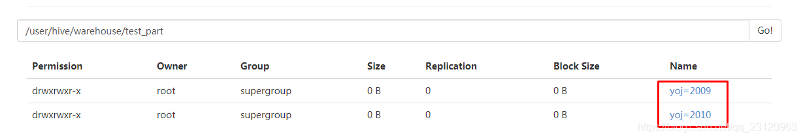

# Hive学习笔记

## 基本架构

[](https://gitee.com/niceshot1/niceshot-image-bed/raw/master/tech_bigdata/hive整体笔记.md/3955710169490.png)

- 整个hive由hiveserver2和hive 客户端组成
- hive客户端有三种，beeline 、使用jdbc链接hiveserver、或使用hive CLI(这个已经过时，hive官方已经不推荐，推荐beeline)
- hive server本身由hive server2和metastore组成
- metastore是hive的元数据管理组件
- hcatalog 架设在metastore上，暴露一组api，使得其它框架，比如Pig，FLink能够使用hive的元数据管理功能，从而以表视角去管理数据
- webchat 是在hcatalog基础上暴露restful接口
- hive 的实际数据存储在hadoop的hdfs中
- hue提供一个图形化的方式，方便用户做基于sql的开发，当然还有其他附加功能

参考文档：https://www.cnblogs.com/niceshot/p/15448688.html


## Hive SQL 

- 大小写敏感

- 查看方法

  ```
  SHOW FUNCTIONS;
  DESCRIBE FUNCTION <function_name>;
  DESCRIBE FUNCTION EXTENDED <function_name>;
  ```


## partition和bucket的对比

- partition和bucket都是提供类似索引的作用的，加快数据的查询效率的。
- partition在HDFS上的实现形式是按具体的分区值区分文件夹，分区值为文件夹的名称。粒度比较粗，就是分区列的distinct值比较少。因为如果多的话，会影响查询性能的。不过可以使用多级分区，文件夹里面再分文件夹。
- bucket在HDFS上的实现形式是按桶分文件的。补充了partition的功能，适用于分桶列的distinct值比较多的情况。

## bucket如何确定分桶数？

- 分桶数需要在create table时指定，那如何确定桶数呢？
- 分桶数的多少，取决于表或者分区下的数据量，尽量让每个桶文件大小合理。数据量大，分桶数就多。
- 另外就是要参考blockSize，如256M，那就可以设置桶数让文件大小在256~512M。

## bucket join

- bucket是HDFS上是分文件存在的，不像分区是分文件夹的

  - 分区的文件夹分布

  

  - 分桶的文件分布

  

- 桶居于相同的列、且桶数是倍数关系。如下，table1有8个bucket、table2有4个

 retrieves the only corresponding bucket of Table1 (smaller table) to complete the join task..png)

- [ ] 时间戳的使用

- [ ] 复杂结构的使用：struct、map、array

- [ ] hive的类型检查


## 各种by

order by 是全局排序，可能性能会比较差，orderby生成一个reduce，数据量比较大是有性能瓶颈；
sort by分区内有序，往往配合distribute by来确定该分区都有那些数据；
distribute by确定了数据分发的规则，满足相同条件的数据被分发到一个reducer，常用于解决小文件问题；
cluster by当distribute by和sort by字段相同时，可以使用cluster by代替distribute by和sort by，但是cluster by默认是升序，不能指定排序方向。


## 各种join


## map join


## skew join

- 基本原理：

  - 现在有两张表，table1和table2，在key上做join，table1中K1倾斜了。

  - 将table1和table2的K1的数据分别输出到HDFS，然后再使用map join去处理，如图红色框标识。

    

- 参数设置

可以通过以下的参数设置 让hive 自动的对skew key 进行处理:

1.hive.optimize.skewjoin=true (default :false)
该参数通过在Hive 对物理执行计划优化时 ,添加一个Map Join用于处理Skew Key .

目前该优化方案是不支持Outer Join的! 

2.hive.skewjoin.key = <判断key为Skew key 的阈值>  (default : 100000) 
在参数 hive.optimize.skewjoin=true 时, Hive的reuce 任务会在处理join key 的时候 判断其数量是否大于该 阈值,如果是将作为一个Skew Join 处理


- [ ] 3种UDF：User Defined Functions（UDF）、User Defined Aggregation Functions（UDAF）、User Defined Table Generating Functions（UDTF）


## hive工作原理


## explain 妙用

- 妙用explain对于SQL优化事半功倍

  


## 存储格式、压缩格式对比


## 数据倾斜

- 数据倾斜是数据分布不均匀，一部分task需要处理大量的数据，导致job耗时很长。对于hive或者MR来说，数据倾斜一般发生在reduce阶段。map阶段一般不会发生，除非某个文件特别大；不过这种在上传HDFS的时候，就会被分成小文件上传。那如何避免数据倾斜呢？想办法避免局部的task需要处理大量的数据。

  - 尽量减少数据的输入（提前filter数据 分区或者桶、在map段做预处理 map聚合）、

  - 增加reduce数

  - 人为干预打乱倾斜的key

    - 优化干预计算逻辑

    - 重写业务逻辑,这个需要结合具体的场景重写，例如：在日志表与用户表关联时候（通过user_id关联），直接关联可能导致user_id为null的发生数据倾斜，此时可以把日志表中user_id为null的单独处理，如下：

      ```sql
      SELECT a.xx, b.yy FROM log a JOIN users b 
                  ON a.user_id IS NOT NULL 
                      AND a.user_id = b.user_id 
      UNION ALL 
      SELECT a.xx, NULL AS yy FROM log a WHERE a.user_id IS NULL;
      ```
    
    - skew 的使用，控制启动两个MR Job完成，第一个Job先不按GroupBy字段分发，而是随机分发做一次聚合，然后启动第二个Job，拿前面聚合过的数据按GroupBy字段分发计算出最终结果
    
      

- 参数优化

- 数据处理