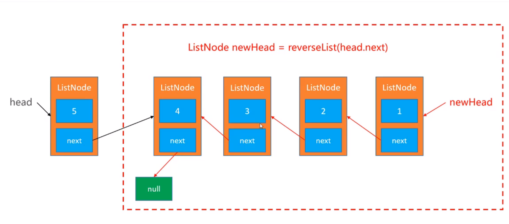
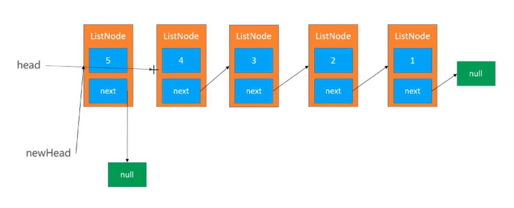

# 链表
## 链表的反转
- 递归
  - 思想：
    - 假设`reverseList(head)`可以链表反转，最后返回`newHead`；那么`reverseList(head.next)`就能实现红色框框内的反转
    - 递归函数对`head`适用，对`head.next`也会适用，即对子集也适用；以后做递归的时候，可以往这方面思考
  - 结束条件：`reverse`最后一个`node`时，结束，当前节点为最后的`newHead`



- 迭代

  ```python
  newHead = None
  while(head != None):
      nxt = head.next
      head.next = newHead
      newHead = head
  
      head = nxt
  return newHead
  ```


