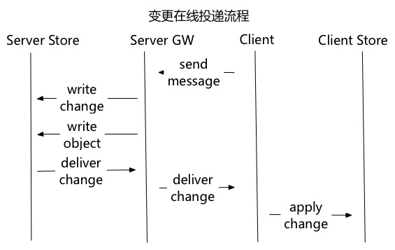

# 多终端数据同步调研

- 客户端需要针对具体的业务场景设计缓存，不用每次都全量更新。server需要保存更新记录和最后更新之后的最终结果
- 多人协作场景下，数据需要实时同步到不同用户的不同设备上。
- 
- 同步机制是通过服务器通知，客户端拉取机制实现的。IM协议投递的是新消息的通知，拉取是根据版本号增量同步，将消息投递转换为基于状态同步的协议。
- 每个Folder的版本号是严格有序递增的，Folder不是按照会话划分的。
- 微信投递消息和邮件类似，是将消息投递到每个人的收件箱中，每投递一个消息增加一个版本号。
- 客户端数据能自修复达到最终一致性。
- 多个服务接口可以使用相同的同步机制

- 记录对象变更历史

- 实时投递变更而不是数据对象，也不是通知

- 客户端通过回放变更来更新数据

- 支持多种数据对象(联系人/消息/群组)

- 冲突解决(新数据优先)

  

下面详细说明下我们的协议

1. **数据格式**

   

   - 每个需要同步的数据集抽象成一个Folder，Folder可能是多人共享的，也可能是某人专用的。这里的Folder相当于一个索引表，引用的是对象ID。
   - 每个Folder维护一个变更集（ChangeSet），增量同步通过变更实现，变更的版本号有序递增。变更是每次操作生成的，每一次Folder索引或者Folder引用对象的操作都生成一个变更。
   - 变更（Change）有对应的操作（OP）。如：新增、更新、删除等。包括索引变更和索引引用对象的变更，携带变更数据。客户端根据操作要在本地实现重放逻辑。
   - 每个Folder中的索引对象会被分配一个该Folder中的有序递增ID。每个索引对象也可以拥有自定义属性。
   - 所有的数据对象都统一定义，有更新时间，等基本字段。抽象出通用的操作接口（ObjectStore）。
   - 客户端会通过Change将服务器的Folder及对象库同步下去，不过同步的只是服务器上的一个子集，并不是全量。

2. **投递流程**

   

   - 客户端的操作（发消息）生成变更，写数据对象
   - 将变更投递给在线的设备
   - 客户端应用变更到本地仓库

3. **同步流程**

   

   - 离线客户端上线，发起同步请求，携带客户端本地的最新版本号
   - 服务根据客户端版本号查询变更集，返回客户端
   - 客户端在本地回放变更

4. **一致性保证**

   

   - 客户端收到变更后，会检查变更的版本号是否和本地最新变更版本号连续，不连续就说明有消息丢失。
   - 如果有消息丢失，客户端先发起一次同步请求，补全丢失的数据，合并变更再在本地回放。

5. 

客户端是TCP长连接，Web版本是WebSocket。消息推送：推模式(comet，websocket, 长连接)。

**这个版本号必须是有序的吗？是否可以跟****Git一样用随机字符+链表的方式做？**

我们这个方案里版本号必须是有序严格递增的，因为要靠这个判断是否丢失消息

- Exchange ActiveSync（Mail, Calendar and Address Book）微软的协议
- WeiSync（微信） 公开分享说明是参考ActiveSync实现的，但没有详细的说明。
- 