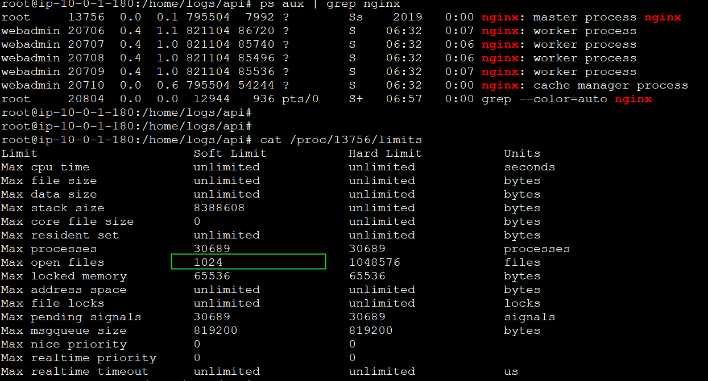

## 错误log

```shell
2020/12/24 06:39:09 [alert] 8315#0: *4128715829 socket() failed (24: Too many open files) while connecting to upstream, client: 190.239.41.174, server: api2.mobo.ai, request: "GET /client/v3/wallpaper_4k/wallpaperList.json?sign=9939e1fa528ec5b4b1145e2045483929&packageName=com.depth.visual.wallpaper4d&versionCode=22&tm=1608791954296&page=1&pageSize=20 HTTP/1.1", upstream: "http://10.0.0.103:8301/client/v3/wallpaper_4k/wallpaperList.json?sign=9939e1fa528ec5b4b1145e2045483929&packageName=com.depth.visual.wallpaper4d&versionCode=22&tm=1608791954296&page=1&pageSize=20", host: "api2.mobo.ai"
```


## 解决方法

原因很明显`Too many open files`， Google解决方法，对比多个，尝试最靠谱的；

1. ps aux | grep nginx 查看nginx worker的pid； cat /proc/pid/limits 查看限制

   

   如图，soft open files的只只有1024

   

1. 调大soft open files

   ```shell
   # /etc/security/limits.conf 文件中添加 * soft nofile 65535
   # 运行命令生效
   sysctl -p
   nginx -s reload
   
   # 再去查看nginx进程的limits, 并没有变化
   ```

   

   ```shell
   # vim /usr/local/nginx/conf/nginx.conf  
     
   worker_rlimit_nofile 65535;  //添加
   
   events {
     use epoll;
     worker_connections  65535; //足够大了，不用改
   }
   
   root@ip-10-0-0-18:/home/logs/api# nginx  -t 
   nginx: the configuration file /usr/local/nginx/conf/nginx.conf syntax is ok
   nginx: configuration file /usr/local/nginx/conf/nginx.conf test is successful
   root@ip-10-0-0-18:/home/logs/api# nginx  -s reload
   
   ```

   

查看limits已生效，check error_log 没有再报错了